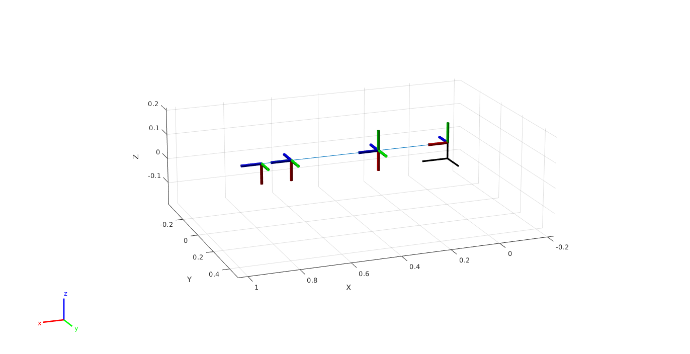

Mathematical Background
=======================

The following is a brief overview of the mathematical background of the
kinematic control of the arm.

The arm is a &-DoF manipulator, this means that we can position and orient the end-effector as we wish.
The scheme of the arm is shown in the figure below.

The configuration shown in the slide is the zero (home) configuration of the arm.
The Denavith-Hartenberg (DH) formalism is considered to find the kinematics equations of the arm.
The DH parameters of the arm are shown in the table below.

+--------+-----------+----------------+----------------+------------------+
| Link   | :math:`a` | :math:`\alpha` | :math:`d`      | :math:`\theta`   |
+========+===========+================+================+==================+
| 1      | 0         | :math:`\pi/2`  | 0.0655         | :math:`q_1`      |
+--------+-----------+----------------+----------------+------------------+
| 2      | 0.2950    | 0              | 0.0            | :math:`q_2`      |
+--------+-----------+----------------+----------------+------------------+
| 3      | 0.0       | :math:`-\pi/2` | 0.0            | :math:`q_3-\pi/2`|
+--------+-----------+----------------+----------------+------------------+
| 4      | 0.0       | :math:`\pi/2`  | 0.3610         | :math:`q_4`      |
+--------+-----------+----------------+----------------+------------------+
| 5      | 0.0       | :math:`-\pi/2` | 0.0            | :math:`q_5`      |
+--------+-----------+----------------+----------------+------------------+
| 6      | 0.0       | 0              | :math:`l_{ee}` | :math:`q_6`      |
+--------+-----------+----------------+----------------+------------------+

The joint angles are denoted by
:math:`q_1, q_2, q_3, q_4, q_5, q_6`.

The link lenght are denoted by
:math:`l_1 = 0.2950, l_2 = 0.3610`.

The end-effector lenght can differ from the task considered. The two main values are:
:math:`l_{ee} = 0.1400` for the maintenance, and :math:`l_{ee} = 0.090` for the pirulation (science).

From the formalism we can derive the direct and inverse kinematics equations of the arm.

Direct Kinematics
-----------------

The direct kinematics equations are given by the product of the homogeneous transformation matrices of each link.
The homogeneous transformation matrix of the link :math:`i` is given by

.. math::
    ^{i-1}T_i = \begin{bmatrix}
    c_{\theta_i} & -s_{\theta_i}c_{\alpha_i} & s_{\theta_i}s_{\alpha_i} & a_ic_{\theta_i} \\
    s_{\theta_i} & c_{\theta_i}c_{\alpha_i} & -c_{\theta_i}s_{\alpha_i} & a_is_{\theta_i} \\
    0 & s_{\alpha_i} & c_{\alpha_i} & d_i \\
    0 & 0 & 0 & 1
    \end{bmatrix}

where :math:`c_{\theta_i} = \cos(\theta_i)` and :math:`s_{\theta_i} = \sin(\theta_i)`.

The direct kinematics equations are given by

.. math::
    ^0T_6 = ^0T_1 ^1T_2 ^2T_3 ^3T_4 ^4T_5 ^5T_6

The direct kinematics equations are implemented in the function :func:`dir_kin_total` and :func:`dir_kin_total_with_rot`
with both of them returning the end-effector (ee) position, and the second also returning the rotation matrix.

Inverse Kinematics
------------------

The inverse kinematics is solved in two steps: \n
first the desired position of the wrist center is calculated from the desired position in the end-effector frame, 
The desired position of the wrist center is given by

.. math::
    ^0p_{wc} = ^0p_{ee} - d_6 ^0R_{target}

where :math:`^0p_{ee}` is the desired position of the end-effector in the base frame, :math:`^0R_{target}` is the desired
rotation matrix of the end-effector in the base frame, and :math:`d_6` is the length of the last link of the arm (to reach the wrist center).

The inverse kinematics equations of this first step are given by:

.. math::
    q_1 &= \arctan\left(\frac{y}{x}\right) \\
    \\
    c_3 &= \frac{^0p_{wc,x}^2 + ^0p_{wc,y}^2 + (^0p_{wc,z}-d_0)^2 - l_1^2 - l_2^2}{2l_1l_2} \\
    s_3 &= \pm\sqrt{1-c_2^2} \\
    q_3 &= \arctan2(s_2, c_2) \\
    \\
    \begin{bmatrix}
    c_1 \\
    s_1
    \end{bmatrix} &= \begin{bmatrix}
    l_1+l_2c_3 & -l_2s_3 \\
    l_2s_3, l_1+l_2c_3
    \end{bmatrix}^{-1}
    \begin{bmatrix}
    c_1 ^0p_{wc,x} + s_1 ^0p_{wc,y} \\
    ^0p_{wc,z} - d_0
    \end{bmatrix} \\
    q_2 &= \arctan2(s_1, c_1) \\

The second component of the inverse kinematics is finding :math:`q_4, q_5, q_6` by making the orientation of 
the end-effector coincide with the desired one.
The inverse kinematics equations of this second step are given by imposing the following equality

.. math::
    ^0R_{ee} = ^0R_{wc}(q_1, q_2, q_3) ^{wc}R_{ee}(q_4, q_5, q_6) = ^0R_{target}

where :math:`^0R_{ee}` is the rotation matrix of the end-effector in the base frame, and :math:`^0R_{target}` is the desired
rotation matrix of the end-effector in the base frame, :math:`^0R_{wc}` is the rotation matrix of the wrist center in the base frame,
already decided by the found value of the first three joints, and :math:`^{wc}R_{ee}` is the rotation matrix of the ee in the wc frame,
which is dependent only by the three last joints.

By finding the analytic expression of :math:`^{wc}R_{ee}`, the values of the last three joints can be found inverting the equation above.

The analytic expression of :math:`^{wc}R_{ee}` is given by

.. math::
    ^{wc}R_{ee} = \begin{bmatrix}
    c_4c_5c_6 - s_4s_6 & -c_4c_5s_6 - s_4c_6 & c_4s_5 \\
    s_4c_5c_6 + c_4s_6 & -s_4c_5s_6 + c_4c_6 & s_4s_5 \\
    -s_5c_6 & s_5s_6 & c_5
    \end{bmatrix}

So the inverse kinematics equations of the second step are given by

.. math::
    q_4 &= \arctan\left(\frac{-R_{sol,23}}{-R_{sol,13}}\right) \\
    q_5 &= \arctan\left(\frac{1-R_{sol,33}^2}{R_{sol,33}}\right) \\
    q_6 &= \arctan\left(\frac{-R_{sol,32}}{-R_{sol,31}}\right) \\

where :math:`R_{sol,ij}` is the element of the rotation matrix :math:`R_{sol} = ^0R_{wc}(q_1, q_2, q_3)'` :math:`^0R_{target}`.

The inverse kinematics equations are implemented in the function :func:`inv_kin_total_bis`.

The inverse kinematics equations are not unique:
there are 8 possible solutions that are generated by the different possible signs of the :math:`sqrt`,
and the solution of the inverse kinematics equations is not always possible, given the workspace and the joint limits.
This cases are accounted by the function :func:`best_qp`